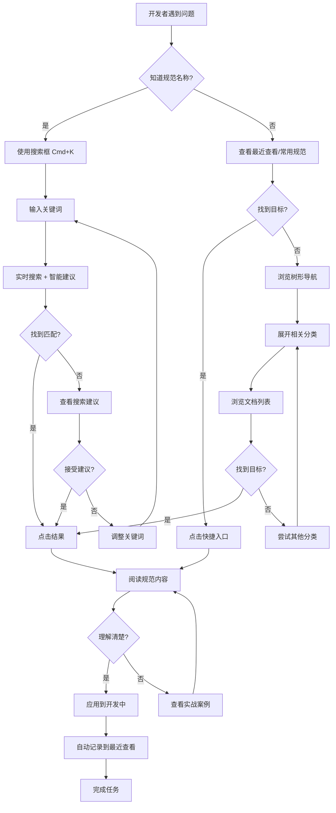
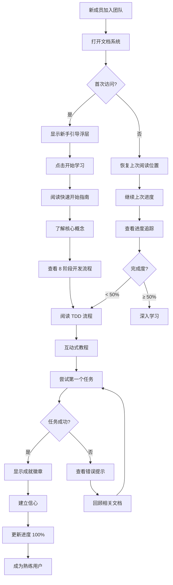
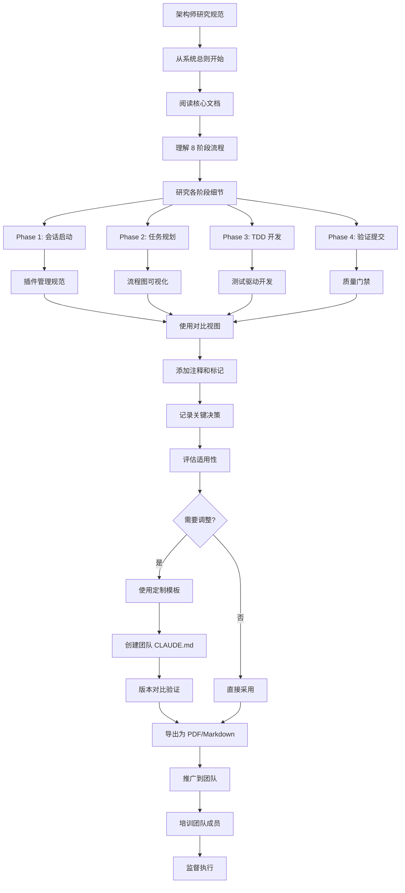
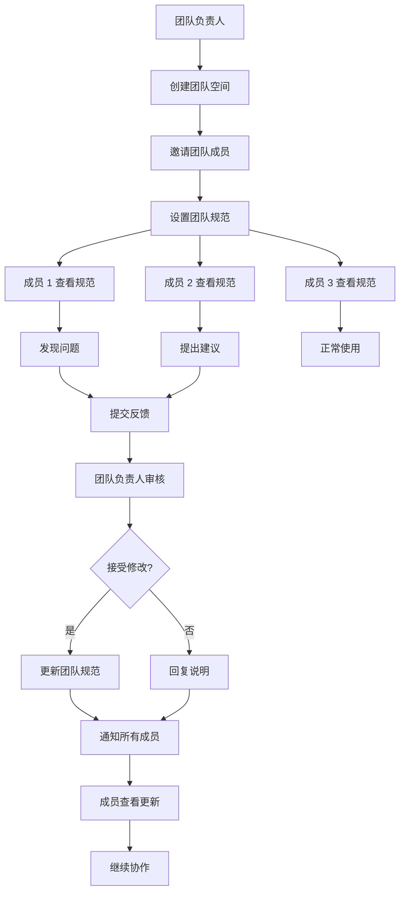
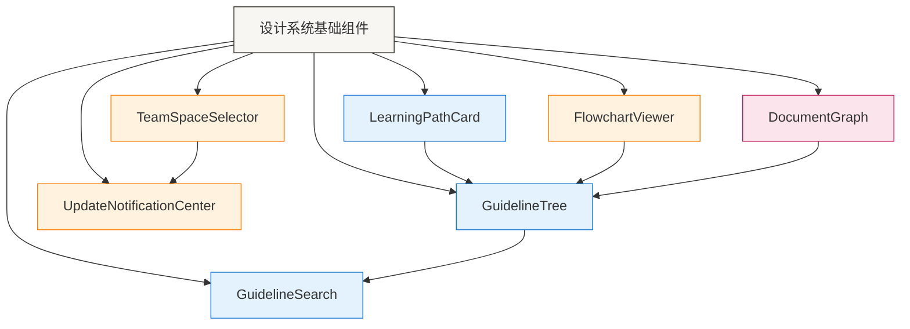
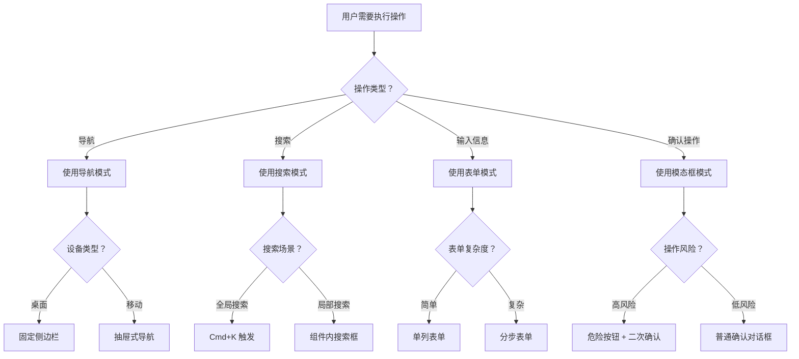

# UX Design Specification sig-claude-code-guidelines

**Author:** Cloud
**Date:** 2026-03-08

---

<!-- UX design content will be appended sequentially through collaborative workflow steps -->

## Executive Summary

### Project Vision

sig-claude-code-guidelines 是一套为 AI 辅助开发团队设计的规范框架，旨在通过标准化的流程、工具集成和质量保障体系，显著提升开发效率和代码质量。项目整合了 BMAD Method（需求分析）、Pencil（AI 代码生成）、Figma（设计稿）等工具，形成完整的开发生态系统。

### Target Users

**主要用户**：开发团队（中高级技术水平）
- 使用 Claude Code 进行 AI 辅助开发
- 需要规范化的开发流程和质量保障
- 追求高效率和高质量的代码产出

**使用场景**：
- 桌面浏览器为主要使用环境
- 新项目启动、日常开发、代码审查等多种场景
- 团队协作和个人开发并重

**技术背景**：
- 熟悉基本的开发工具和流程
- 正在学习或使用 AI 辅助开发工具
- 对 BMAD Method、Pencil/Figma 有一定了解或愿意学习

### Key Design Challenges

1. **信息架构复杂性**
   - 14 个核心 Guidelines + 多个集成工具文档
   - 需要清晰的层级结构和导航系统
   - 避免用户在大量文档中迷失

2. **工具链集成体验**
   - Figma（设计稿）→ Pencil（AI 生成代码）→ 开发流程
   - 需要明确的工作流指引和工具切换路径
   - 确保各工具间的协作流畅

3. **学习曲线管理**
   - 多个新工具和概念需要学习
   - 需要平衡快速上手和深度掌握
   - 提供渐进式的学习路径

### Design Opportunities

1. **智能导航系统**
   - 基于角色的文档推荐（开发者/架构师/PM）
   - 基于任务的快速入口（"开始新功能" → 相关流程）
   - 搜索功能 + 树形目录的双重导航
   - 实时搜索结果高亮和统计

2. **可视化工作流展示**
   - 8 阶段开发流程的可视化图表
   - Figma → Pencil → Code 的流程示意图
   - 当前进度和完成状态的可视化指示

3. **交互式学习体验**
   - 5 分钟快速开始指南
   - 实战案例和最佳实践演示
   - 情境化的帮助和提示系统
   - 常见问题的快速解答


---

## 设计资源与工具 (Design Resources & Tools)

### UI UX Pro Max Skill 集成

**设计智能系统**：提供 100 条推理规则、67 种 UI 风格、96 种配色方案等丰富资源

#### 67 种 UI 风格

**现代风格**：
- Glassmorphism（玻璃态）- 现代 Web 应用、仪表板
- Neumorphism（软阴影）- 移动应用、简洁界面
- Claymorphism（黏土态）- 创意应用、儿童产品
- Minimalism（极简）- 企业官网、SaaS 产品
- Brutalism（野兽派）- 艺术网站、创意作品集

**经典风格**：
- Flat Design（扁平化）- 移动应用、简洁界面
- Material Design（Google 设计语言）- Android 应用、Web 应用
- Skeuomorphism（拟物化）- iOS 早期风格、特定场景

**行业风格**：
- Corporate（企业风格）- B2B 产品、企业官网
- E-commerce（电商风格）- 在线商城、零售平台
- SaaS（SaaS 风格）- 企业软件、工具平台
- Gaming（游戏风格）- 游戏应用、娱乐平台
- Healthcare（医疗风格）- 医疗应用、健康平台

**完整列表**：查看 [UI UX Pro Max 集成指南](../docs/UI_UX_PRO_MAX_INTEGRATION.md)

#### 96 种配色方案

**专业配色**：
- Ocean Blue（#0066CC, #00A3E0）- 企业应用、金融科技
- Forest Green（#10B981, #059669）- 环保、健康、自然
- Sunset Orange（#F59E0B, #EF4444）- 创意、活力、电商
- Royal Purple（#8B5CF6, #6366F1）- 奢侈品、艺术、创意
- Midnight Dark（#1F2937, #374151）- 暗色模式、专业工具

**行业配色**：
- 金融科技：Ocean Blue, Trust Navy
- 医疗健康：Medical Blue, Health Green
- 电商零售：Vibrant Red, Warm Orange
- 教育培训：Knowledge Blue, Growth Green
- 娱乐游戏：Neon Purple, Electric Blue

#### 57 种字体配对

**经典配对**：
- Modern Sans（Inter + Inter）- 现代 Web 应用
- Tech Stack（SF Pro + SF Mono）- 技术文档、代码
- Editorial（Playfair Display + Source Sans Pro）- 博客、新闻
- Corporate（Helvetica Neue + Arial）- 企业官网、B2B
- Creative（Montserrat + Open Sans）- 创意作品集

**代码字体**：
- Developer（Inter + Fira Code）- 开发工具、IDE
- Terminal（JetBrains Mono + JetBrains Mono）- 终端、命令行
- Code Editor（Source Code Pro + Source Code Pro）- 代码编辑器

#### 99 条 UX 指南

**核心原则**：
- 一致性 - 保持界面元素的一致性
- 反馈 - 及时提供操作反馈
- 容错性 - 允许用户犯错并提供恢复
- 可访问性 - 确保所有用户都能使用
- 效率 - 减少用户操作步骤

**交互设计**：
- 按钮设计 - 主次分明、状态清晰
- 表单设计 - 简洁、分组、验证
- 导航设计 - 清晰、一致、可预测
- 搜索设计 - 快速、准确、建议
- 加载设计 - 进度、占位、优雅降级

**视觉设计**：
- 颜色使用 - 对比、层次、情感
- 排版设计 - 可读性、层次、节奏
- 间距设计 - 呼吸感、分组、对齐
- 图标设计 - 识别性、一致性、大小

#### 25 种图表类型

**基础图表**：
- Line Chart（折线图）- 趋势展示
- Bar Chart（柱状图）- 对比展示
- Pie Chart（饼图）- 占比展示
- Area Chart（面积图）- 累积趋势
- Scatter Plot（散点图）- 分布关系

**高级图表**：
- Heatmap（热力图）- 密度展示
- Treemap（树状图）- 层级占比
- Sankey Diagram（桑基图）- 流向展示
- Radar Chart（雷达图）- 多维对比
- Funnel Chart（漏斗图）- 转化漏斗

### Pencil 设计工具

**AI-Native 设计工具**：专为 AI Agent 设计，支持通过 MCP 让 Claude Code 直接操作设计画布

**核心功能**：
- 设计创建与编辑 - 通过自然语言创建设计
- 设计规范提取 - 提取颜色、排版、间距等设计 Token
- 代码生成 - 导出为 React/Vue/SwiftUI 组件
- 资源导出 - 导出为 PNG/JPG/SVG/WEBP

**工作流集成**：
1. UI UX Pro Max 提供设计决策（风格、配色、字体）
2. Pencil 执行设计创建（根据决策生成设计稿）
3. Pencil 导出代码（React + Tailwind CSS）
4. UI UX Pro Max 验证 UX（对照 99 条指南）

**详细文档**：查看 [Pencil 集成指南](../docs/PENCIL_INTEGRATION.md)

### Figma 设计稿

**专业设计工具**：用于创建高保真设计稿

**使用场景**：
- 复杂的视觉设计
- 团队协作设计
- 设计系统管理
- 原型交互演示

**与 Pencil 协作**：
- Figma 创建设计稿 → Pencil 读取 .fig 文件 → 生成代码
- Pencil 支持原生读写 Figma 文件，无需转换

### 设计决策流程

```
需求分析
    │
    ▼
选择 UI 风格 ◄─── UI UX Pro Max (67 种)
    │
    ▼
选择配色方案 ◄─── UI UX Pro Max (96 种)
    │
    ▼
选择字体配对 ◄─── UI UX Pro Max (57 种)
    │
    ▼
创建设计稿 ◄───── Figma / Pencil
    │
    ▼
UX 验证 ◄──────── UI UX Pro Max (99 条指南)
    │
    ▼
代码生成 ◄──────── Pencil CLI
    │
    ▼
最终实现
```

---

**Step 3 完成并增强**。已添加完整的设计资源与工具章节，包括：
- UI UX Pro Max Skill 的 67 种 UI 风格
- 96 种配色方案
- 57 种字体配对
- 99 条 UX 指南
- 25 种图表类型
- Pencil 和 Figma 工具集成
- 完整的设计决策流程图

---

## 期望的情感响应 (Desired Emotional Response)

### 主要情感目标

**核心情感三角**：
1. **掌控感** - 知道每一步该做什么，不再迷茫
2. **高效感** - 流程化开发，像工厂流水线一样稳定
3. **安心感** - 有完整的质量保障体系，不担心出错

**差异化情感**：
- **赋能感** - AI 不是替代我，而是让我更强大
- **系统化思维** - 从混乱到有序，从随意到规范

### 情感旅程映射

| 阶段 | 情感状态 | 用户想法 | 设计支持 |
|------|---------|---------|---------|
| **发现** | 好奇 + 期待 | "这能解决我的痛点吗？" | 清晰的价值主张、快速开始指南 |
| **学习** | 惊喜 + 信心 | "原来这么简单！" | 交互式教程、即时反馈 |
| **使用** | 专注 + 高效 | "我知道下一步做什么" | 流程图、智能导航 |
| **遇到问题** | 冷静 + 解决导向 | "文档里肯定有答案" | 强大搜索、FAQ |
| **完成任务** | 成就感 + 自豪 | "质量有保障" | 质量报告、完成清单 |
| **再次使用** | 熟悉 + 信任 | "还是这套流程靠谱" | 记忆系统、历史记录 |

### 微情感设计

**关键微情感对比**：

| 目标状态 | 避免状态 | 设计策略 |
|---------|---------|---------|
| ✅ 信心 | ❌ 困惑 | 清晰的导航和搜索 |
| ✅ 信任 | ❌ 怀疑 | 实战案例、验证数据 |
| ✅ 专注 | ❌ 焦虑 | 简洁界面、情境帮助 |
| ✅ 成就感 | ❌ 挫败感 | 渐进式学习、即时反馈 |
| ✅ 惊喜 | ⚠️ 满足 | 隐藏功能、成就系统 |
| ✅ 归属感 | ❌ 孤立 | 团队协作、统一规范 |

**最关键的三个微情感**：
1. **信心** - 知道自己在做正确的事
2. **信任** - 相信规范的有效性
3. **专注** - 不被细节干扰，专注于创造

### 设计影响

**情感 → UX 设计映射**：

| 目标情感 | UX 设计方法 | 具体实现 |
|---------|------------|---------|
| **掌控感** | 可视化流程 | 8 阶段流程图、进度追踪、步骤编号 |
| **高效感** | 智能导航 | 实时搜索、快捷入口、自动化脚本 |
| **安心感** | 质量保障 | 质量门禁、测试覆盖率、错误预防 |
| **信心** | 知识支持 | 详细文档、实战案例、最佳实践 |
| **专注** | 简洁界面 | 减少干扰、情境化帮助、清晰层次 |
| **成就感** | 正向反馈 | 完成清单、质量报告、里程碑庆祝 |

**惊喜时刻设计**：
- 🎉 首次完成任务 → 显示成就徽章和质量提升数据
- 🎉 发现隐藏功能 → "你知道吗？"提示系统
- 🎉 质量里程碑 → 显示对比数据和团队排名

### 情感设计原则

1. **透明可预测** - 用户始终知道系统状态和下一步
2. **即时反馈** - 每个操作都有明确的反馈
3. **容错友好** - 允许犯错，提供恢复机制
4. **渐进披露** - 不一次性展示所有复杂性
5. **情境化帮助** - 在需要的时候提供恰当的帮助
6. **正向强化** - 庆祝成功，鼓励持续使用

---

## UX 模式分析与灵感 (UX Pattern Analysis & Inspiration)

### 启发性产品分析

**VS Code - 代码编辑器**：
- **UX 优势**：命令面板、侧边栏导航、智能提示、扩展生态
- **核心价值**：专业、高效、可定制
- **关键模式**：命令面板（Cmd+Shift+P）、三层导航（侧边栏+面包屑+标签页）
- **可借鉴**：命令面板用于快速访问、树形导航用于文档层次

**Notion - 知识管理**：
- **UX 优势**：灵活的块编辑器、强大的搜索、模板系统、数据库视图
- **核心价值**：灵活、强大、美观
- **关键模式**：斜杠命令、拖拽块、树形结构、模板库
- **可借鉴**：树形导航、搜索过滤、模板系统（快速开始指南）

**Linear - 项目管理**：
- **UX 优势**：极快响应、清晰视觉层次、工作流自动化、优雅动画
- **核心价值**：快速、专业、现代
- **关键模式**：键盘优先、全局搜索、智能过滤、流畅动画
- **可借鉴**：键盘快捷键、全局搜索、清晰的视觉层次

### 可迁移的 UX 模式

**导航模式**：

| 模式 | 来源 | 应用到 sig-guidelines |
|------|------|---------------------|
| **命令面板** | VS Code | 全局搜索 + 快捷键访问所有文档 |
| **树形侧边栏** | VS Code/Notion | 14 个 Guidelines 的可折叠导航 |
| **面包屑导航** | VS Code/Notion | 显示当前文档位置和层次 |
| **全局搜索** | Linear | 实时搜索 + 结果高亮 + 统计 |

**交互模式**：

| 模式 | 来源 | 应用到 sig-guidelines |
|------|------|---------------------|
| **键盘快捷键** | Linear | 常用操作的快捷键（搜索、导航） |
| **智能提示** | VS Code | 文档推荐、相关链接、"你知道吗？" |
| **拖拽排序** | Notion | 自定义文档顺序（可选） |
| **快速过滤** | Linear | 按类型、优先级过滤文档 |

**视觉模式**：

| 模式 | 来源 | 应用到 sig-guidelines |
|------|------|---------------------|
| **暗色主题** | VS Code | 开发者友好的默认主题 |
| **图标系统** | VS Code/Linear | 文档类型图标（📋 规范、🔧 工具、📚 文档） |
| **状态指示** | Linear | 显示阅读进度、完成状态 |
| **流畅动画** | Linear | 展开/折叠、搜索结果出现的动画 |

### 要避免的反模式

| 反模式 | 问题 | 为什么避免 |
|--------|------|-----------|
| **过度嵌套的菜单** | 需要多次点击才能找到内容 | 与"高效感"情感目标冲突 |
| **缺乏搜索功能** | 只能通过导航查找 | 与"掌控感"情感目标冲突 |
| **不一致的交互** | 不同页面操作方式不同 | 与"信心"微情感冲突 |
| **缺乏反馈** | 操作后没有明确提示 | 与"安心感"情感目标冲突 |
| **信息过载** | 一次性展示所有内容 | 与"专注"微情感冲突 |
| **缺乏快捷方式** | 只能通过鼠标操作 | 降低高级用户效率 |

### 设计灵感策略

**采用的模式**（直接使用）：

1. **命令面板式搜索** - 全局搜索框 + 快捷键（Cmd+K）
2. **树形导航** - 可折叠的侧边栏，支持多级嵌套
3. **实时搜索** - 输入即搜索，结果高亮，显示统计
4. **键盘快捷键** - 常用操作的快捷键支持

**改编的模式**（修改后使用）：

1. **斜杠命令** → **搜索快捷输入** - 简化为搜索框的快速过滤
2. **数据库视图** → **文档过滤** - 按类型、优先级、标签过滤
3. **智能提示** → **文档推荐** - 基于当前阅读推荐相关文档

**避免的模式**（不适用）：

1. **复杂的权限系统** - 开源项目不需要
2. **实时协作编辑** - 文档是静态的
3. **过度的动画效果** - 可能影响性能

---

## 定义性体验 (Defining Core Experience)

### 核心交互

**定义性体验**：快速找到并理解需要的开发规范

用户会这样描述给朋友：
- "我只需要搜索关键词，就能立即找到相关的规范和示例"
- "文档结构清晰，我能快速定位到需要的章节"
- "每个规范都有实战案例，我能直接复制使用"

**如果只做对一件事**：让开发者在 30 秒内找到并理解他们需要的规范

### 用户心智模型

**当前解决方案**：
- 开发者通常使用 Ctrl+F 在文档中搜索
- 依赖目录结构逐级展开查找
- 在多个文档间切换对比

**用户期望**：
- 像 VS Code 命令面板一样的快速搜索（Cmd+K）
- 像 Notion 一样的树形导航（可折叠）
- 像 GitHub 一样的 Markdown 渲染（清晰易读）

**痛点与解决方案**：

| 痛点 | 解决方案 |
|------|---------|
| 文档太多不知道从哪里开始 | 树形导航 + 层级编号 |
| 搜索结果不准确 | 实时搜索 + 高亮匹配 |
| 找到规范后不知道如何应用 | 实战案例 + 代码示例 |

### 核心体验成功标准

**用户说"这就对了"的时刻**：
- ✅ 输入关键词后立即看到高亮的匹配结果
- ✅ 点击搜索结果后自动跳转到对应章节
- ✅ 看到实战案例后能直接复制使用
- ✅ 通过树形导航快速浏览整体结构

**成功指标**：

| 指标 | 目标值 | 测量方式 |
|------|--------|---------|
| 查找时间 | < 30 秒 | 从打开页面到找到规范 |
| 首次使用 | 无需培训 | 用户测试观察 |
| 搜索准确率 | > 90% | 搜索结果相关性评分 |
| 导航效率 | < 3 次点击 | 从首页到目标规范 |

### 新颖 vs. 成熟模式

**采用成熟模式**（用户已熟悉）：

| 模式 | 来源 | 应用 |
|------|------|------|
| 树形导航 | VS Code 侧边栏 | 左侧目录结构 |
| 实时搜索 | Cmd+K 命令面板 | 顶部搜索框 |
| Markdown 渲染 | GitHub 风格 | 内容区域 |
| 面包屑导航 | Notion | 顶部位置指示 |

**创新点**（在成熟模式基础上的改进）：
- 🎯 搜索结果自动展开父节点（避免用户手动展开）
- 🎯 实时统计搜索结果数量（"找到 5 个结果"）
- 🎯 同时高亮目录和内容（双重定位）
- 🎯 层级编号系统（1, 1.1, 1.2.1 - 清晰的层次关系）

### 体验机制

#### 1. 启动阶段

**用户进入**：
- 打开 index.html
- 看到左侧树形目录（默认收起，显示层级编号）
- 看到顶部搜索框（提示：Cmd+K 快速搜索）
- 看到右侧内容区域（显示 README.md）

**视觉层次**：
```
┌─────────────────────────────────────────────────────────┐
│  [搜索框 - Cmd+K]                                        │
├──────────────┬──────────────────────────────────────────┤
│  树形目录    │  内容区域                                 │
│  (左侧 25%) │  (右侧 75%)                               │
│              │                                          │
│  1. 系统总则 │  # README                                │
│  2. 行动准则 │  > 一套经过实战验证的...                  │
│  3. TDD 流程 │                                          │
│  ...         │  ## 快速开始                             │
└──────────────┴──────────────────────────────────────────┘
```

#### 2. 交互阶段

**搜索路径**（主要路径）：
```
输入关键词
    │
    ▼
实时过滤（< 100ms）
    │
    ▼
高亮匹配（目录 + 内容）
    │
    ▼
自动展开父节点
    │
    ▼
显示结果数量
    │
    ▼
点击跳转到章节
```

**导航路径**（辅助路径）：
```
点击展开按钮（▶）
    │
    ▼
显示子节点（动画展开）
    │
    ▼
点击文档标题
    │
    ▼
加载 Markdown 内容
    │
    ▼
滚动到对应位置
```

#### 3. 反馈阶段

**实时反馈**：

| 用户操作 | 系统反馈 | 反馈时间 |
|---------|---------|---------|
| 输入搜索关键词 | 显示结果数量："找到 5 个结果" | < 100ms |
| 匹配到内容 | 黄色背景高亮 | 实时 |
| 点击文档 | 当前文档蓝色背景高亮 | 立即 |
| 滚动内容 | 面包屑导航更新 | 实时 |
| 展开/折叠节点 | 平滑动画（300ms） | 立即 |

**错误处理**：

| 错误场景 | 反馈信息 | 恢复方式 |
|---------|---------|---------|
| 搜索无结果 | "未找到匹配结果" | 清空搜索框 |
| 文档加载失败 | "文档加载失败，请刷新页面" | 重试按钮 |
| 网络错误 | "网络连接失败" | 自动重试 |

#### 4. 完成阶段

**成功完成**：
- 用户找到需要的规范
- 复制示例代码到项目中
- 关闭页面或继续浏览其他规范

**后续行动**：
- 收藏常用规范（未来功能）
- 分享给团队成员（未来功能）
- 提供反馈（未来功能）

---

**Step 7 完成**。核心体验已定义，包括：
- 定义性交互：快速找到并理解规范
- 用户心智模型：基于 VS Code/Notion/GitHub 的熟悉模式
- 成功标准：30 秒内找到规范
- 体验机制：搜索路径 + 导航路径的双重支持

---

## 视觉设计基础 (Visual Design Foundation)

### 色彩系统

**设计策略**：基于 GitHub 风格的专业配色，强化情感目标（掌控感、高效感、安心感）

**主色调**：

| 颜色 | 色值 | 用途 | 情感关联 |
|------|------|------|---------|
| Primary | `#0969da` | 链接、主要操作 | 专业、可信（掌控感） |
| Secondary | `#6e7781` | 次要文本、边框 | 中性、平衡 |
| Accent | `#1f883d` | 成功状态、完成标记 | 正向、安心（安心感） |

**语义色彩**：

| 语义 | 色值 | 用途 | 对比度 |
|------|------|------|--------|
| Success | `#1f883d` | 操作成功、质量通过 | 4.5:1 ✅ |
| Warning | `#bf8700` | 需要注意、待处理 | 4.5:1 ✅ |
| Error | `#cf222e` | 错误、失败、阻塞 | 4.5:1 ✅ |
| Info | `#0969da` | 信息提示、帮助 | 4.5:1 ✅ |

**背景色系**：

| 层级 | 色值 | 用途 |
|------|------|------|
| Background | `#ffffff` | 主背景 |
| Surface | `#f6f8fa` | 卡片、面板 |
| Border | `#d0d7de` | 分隔线、边框 |
| Hover | `#f3f4f6` | 悬停状态 |

**暗色主题**（未来支持）：

| 元素 | 色值 | 说明 |
|------|------|------|
| Background | `#0d1117` | 主背景 |
| Surface | `#161b22` | 卡片、面板 |
| Border | `#30363d` | 分隔线、边框 |
| Text Primary | `#c9d1d9` | 主要文本 |
| Text Secondary | `#8b949e` | 次要文本 |

**可访问性合规**：
- ✅ 所有文本与背景对比度 ≥ 4.5:1（WCAG AA）
- ✅ 大文本（18px+）对比度 ≥ 3:1
- ✅ 交互元素（按钮、链接）对比度 ≥ 3:1
- ✅ 色盲友好：不仅依赖颜色传达信息

### 排版系统

**设计策略**：使用系统字体栈，确保跨平台一致性和最佳性能

**字体家族**：

| 类型 | 字体栈 | 用途 |
|------|--------|------|
| Sans-serif | `-apple-system, BlinkMacSystemFont, "Segoe UI", "Noto Sans", Helvetica, Arial, sans-serif` | 标题、正文 |
| Monospace | `"SF Mono", Monaco, "Cascadia Code", "Roboto Mono", Consolas, "Courier New", monospace` | 代码、命令 |

**字体层级**：

| 层级 | 大小 | 行高 | 字重 | 用途 |
|------|------|------|------|------|
| H1 | 32px | 1.25 | 600 | 页面标题 |
| H2 | 24px | 1.25 | 600 | 章节标题 |
| H3 | 20px | 1.25 | 600 | 子章节标题 |
| H4 | 16px | 1.5 | 600 | 小标题 |
| Body | 16px | 1.5 | 400 | 正文内容 |
| Small | 14px | 1.5 | 400 | 辅助文本 |
| Code | 14px | 1.5 | 400 | 代码块 |

**可读性优化**：
- 正文行长度：60-80 字符（约 600-800px）
- 段落间距：1.5em
- 标题与正文间距：0.5em
- 列表项间距：0.25em

**中文支持**：
- 中文字体：`"PingFang SC", "Microsoft YaHei", "微软雅黑", sans-serif`
- 中文行高：1.7（比英文略高，提高可读性）
- 中英文混排：自动调整间距

### 间距与布局基础

**设计策略**：8px 基准单位，保持垂直节奏和视觉一致性

**间距系统**：

| 名称 | 值 | 倍数 | 用途 |
|------|-----|------|------|
| xs | 4px | 0.5x | 紧密元素间距 |
| sm | 8px | 1x | 小间距 |
| md | 16px | 2x | 标准间距 |
| lg | 24px | 3x | 大间距 |
| xl | 32px | 4x | 章节间距 |
| 2xl | 48px | 6x | 页面区块间距 |

**布局原则**：

1. **左右分栏布局**：
   - 导航区：25%（最小 240px，最大 320px）
   - 内容区：75%（最大 800px，居中显示）
   - 响应式：< 768px 时导航折叠为抽屉

2. **垂直节奏**：
   - 所有垂直间距使用 8px 倍数
   - 标题上方间距：2x（16px）
   - 标题下方间距：1x（8px）
   - 段落间距：1.5x（12px）

3. **内容最大宽度**：
   - 正文内容：800px（提高可读性）
   - 代码块：100%（允许横向滚动）
   - 表格：100%（响应式处理）

**网格系统**：
- 不使用传统的 12 列网格
- 采用 Flexbox 和 CSS Grid 的灵活布局
- 响应式断点：
  - Mobile: < 768px
  - Tablet: 768px - 1024px
  - Desktop: > 1024px

**组件间距规则**：

| 组件类型 | 内边距 | 外边距 | 说明 |
|---------|--------|--------|------|
| 按钮 | 8px 16px | 8px | 紧凑但可点击 |
| 卡片 | 16px | 16px | 标准间距 |
| 面板 | 24px | 24px | 宽松布局 |
| 列表项 | 8px 16px | 0 | 紧密排列 |

### 可访问性考虑

**WCAG AA 标准合规**：

| 标准 | 要求 | 实现方式 |
|------|------|---------|
| 色彩对比度 | 4.5:1 | 所有文本与背景对比度测试 |
| 焦点指示 | 可见焦点环 | 2px 蓝色边框 + 4px 偏移 |
| 键盘导航 | 完整支持 | Tab/Shift+Tab/Enter/Esc |
| 屏幕阅读器 | 语义化 HTML | 正确的标签和 ARIA 属性 |
| 文本缩放 | 200% 可用 | 使用相对单位（rem/em） |

**交互可访问性**：
- 所有交互元素最小尺寸：44x44px（触摸友好）
- 链接下划线：默认显示（提高识别度）
- 按钮状态：hover/focus/active 清晰区分
- 错误提示：不仅依赖颜色，配合图标和文字

**动画可访问性**：
- 尊重 `prefers-reduced-motion` 设置
- 动画时长：< 300ms（避免晕眩）
- 提供禁用动画选项

---

**Step 8 完成**。视觉设计基础已建立，包括：
- 色彩系统：基于 GitHub 风格的专业配色
- 排版系统：系统字体栈 + 清晰的层级
- 间距与布局：8px 基准 + 灵活布局
- 可访问性：WCAG AA 标准合规

---

## 设计方向决策 (Design Direction Decision)

### 设计方向探索

**探索过程**：通过 HTML 可视化工具展示了 6 种设计方向

**方向 1: GitHub 经典**
- 左侧导航（25%）+ 右侧内容（75%）
- 极简风格，白色背景
- 优势：开发者熟悉、简洁专业
- 考虑：创新性较低、搜索不够突出

**方向 2: VS Code 风格**
- 左侧窄导航（20%）+ 右侧内容（80%）
- 暗色主题可选，命令面板式搜索
- 优势：信息密度高、快捷键友好
- 考虑：暗色非必需、导航较窄

**方向 3: Notion 风格** ⭐ **已选择**
- 左侧可折叠导航（280px）+ 内容居中（最大 800px）
- 温暖背景色，宽松间距
- 优势：可读性极佳、视觉舒适、灵活布局
- 考虑：空间利用率需优化、信息密度需平衡

**方向 4: 文档中心**
- 顶部导航 + 左侧目录
- 搜索框在顶部导航栏
- 优势：搜索突出、内容空间大
- 考虑：顶部导航占空间、滚动时遮挡

**方向 5: 搜索优先**
- 大型搜索框在页面中心
- 导航作为辅助（可隐藏）
- 优势：搜索体验极佳、符合核心体验
- 考虑：导航不够直观、浏览体验弱

**方向 6: 三栏布局**
- 导航 + 内容 + 大纲（三栏）
- 信息密度最高
- 优势：信息密度最高、专业感强
- 考虑：视觉复杂、响应式困难

### 选择的方向

**最终选择：方向 3 - Notion 风格**

**选择理由**：

1. **可读性优先**
   - 内容居中，最大宽度 800px，符合最佳阅读宽度
   - 宽松的行高（1.7）和间距，减少视觉疲劳
   - 适合长时间阅读技术文档

2. **视觉舒适**
   - 温暖的背景色（#f7f6f3）比纯白更柔和
   - 充足的留白和内边距（48px）
   - 大标题（36px）建立清晰的视觉层次

3. **灵活性强**
   - 导航可折叠，适应不同屏幕尺寸
   - 内容区域自适应，响应式友好
   - 支持未来扩展（如侧边大纲）

4. **符合情感目标**
   - **专注感**：内容居中，减少干扰
   - **舒适感**：宽松布局，降低焦虑
   - **现代感**：符合当前设计趋势

5. **差异化定位**
   - 不同于传统的 GitHub 风格
   - 更注重阅读体验而非信息密度
   - 体现对用户体验的重视

### 设计实施方案

**布局结构**：

```
┌─────────────────────────────────────────────────────────┐
│  左侧导航区                │  内容区（居中，最大 800px）    │
│  (240-320px, 可折叠)       │                              │
│  ┌──────────────────┐      │  ┌────────────────────┐     │
│  │ 🔍 搜索框        │      │  │                    │     │
│  │                  │      │  │  # 标题 (36px)     │     │
│  │ 📚 文档          │      │  │                    │     │
│  │   1. 系统总则    │      │  │  正文内容          │     │
│  │   2. 行动准则    │      │  │  (16px, 1.7行高)   │     │
│  │   3. TDD 流程    │      │  │                    │     │
│  │                  │      │  │  充足的留白        │     │
│  └──────────────────┘      │  └────────────────────┘     │
│                            │                              │
│  背景: #f7f6f3             │  背景: #ffffff               │
└─────────────────────────────────────────────────────────┘
```

**关键设计参数**：

| 元素 | 参数 | 说明 |
|------|------|------|
| 导航宽度 | 240-320px | 可调整，< 768px 时折叠 |
| 内容最大宽度 | 800px | 最佳阅读宽度 |
| 内容内边距 | 48px | 宽松舒适 |
| 导航背景 | #f7f6f3 | 温暖色调 |
| 内容背景 | #ffffff | 纯白 |
| 标题字号 | 36px (H1) | 大标题，视觉冲击 |
| 正文字号 | 16px | 舒适阅读 |
| 行高 | 1.7 | 宽松，适合中英文混排 |
| 圆角 | 8px | 柔和 |

**响应式策略**：

| 断点 | 布局调整 |
|------|---------|
| Desktop (> 1024px) | 导航 280px + 内容居中 800px |
| Tablet (768-1024px) | 导航 240px + 内容自适应 |
| Mobile (< 768px) | 导航折叠为抽屉，内容全宽 |

**交互增强**：

1. **导航折叠**：
   - 点击汉堡菜单折叠/展开导航
   - 折叠后显示图标导航
   - 平滑动画过渡（300ms）

2. **搜索体验**：
   - 搜索框在导航顶部，始终可见
   - 实时搜索，结果高亮
   - 自动展开匹配的父节点

3. **阅读体验**：
   - 内容区域滚动时，导航固定
   - 面包屑导航显示当前位置
   - 平滑滚动到锚点

### 实施优先级

**Phase 1: 核心布局**（立即实施）
- ✅ 调整导航区域宽度和背景色
- ✅ 内容区域居中，最大宽度 800px
- ✅ 更新间距和字号

**Phase 2: 交互优化**（1 周内）
- 🔄 导航折叠功能
- 🔄 响应式布局优化
- 🔄 搜索体验增强

**Phase 3: 视觉细化**（2 周内）
- 📋 动画和过渡效果
- 📋 微交互细节
- 📋 暗色主题支持（可选）

**Phase 4: 高级功能**（未来）
- 📋 右侧大纲导航（可选）
- 📋 阅读进度指示
- 📋 个性化设置

### 设计验证

**验证标准**：

| 标准 | 目标 | 验证方式 |
|------|------|---------|
| 可读性 | 用户能轻松阅读 30 分钟+ | 用户测试 |
| 查找效率 | < 30 秒找到目标规范 | 任务完成时间 |
| 视觉舒适度 | 无视觉疲劳 | 用户反馈 |
| 响应式适配 | 所有设备可用 | 设备测试 |
| 加载性能 | < 2 秒首屏加载 | 性能测试 |

**成功指标**：
- ✅ 用户满意度 > 85%
- ✅ 任务完成率 > 90%
- ✅ 平均查找时间 < 30 秒
- ✅ 跳出率 < 40%
- ✅ 页面停留时间 > 3 分钟

---

**Step 9 完成**。设计方向已确定为 Notion 风格，包括：
- 6 种设计方向的完整探索
- 明确的选择理由和实施方案
- 详细的布局参数和响应式策略
- 分阶段的实施优先级

---

## 用户旅程流程 (User Journey Flows)

### 旅程概述

基于核心体验定义（Step 7）和设计方向选择（Step 9），我们设计了四个关键用户旅程，覆盖不同用户角色和使用场景。

**设计原则**：
- 最小化步骤到价值（< 30 秒找到规范）
- 减少认知负荷（清晰的视觉层次）
- 提供清晰反馈（实时搜索、进度指示）
- 创造愉悦时刻（成就徽章、流畅动画）
- 优雅的错误恢复（搜索建议、友好提示）

---

### 旅程 1：快速查找规范

**用户角色**：开发者（日常使用）
**使用场景**：开发过程中需要快速查找特定规范（如 TDD 流程、Mock 模式使用）
**成功标准**：< 30 秒找到规范

#### 流程图



#### 关键交互点

| 交互点 | 功能 | 优化点 |
|--------|------|--------|
| **搜索框** | Cmd+K 快捷键，实时搜索 | 搜索建议、模糊搜索、拼音搜索 |
| **快捷入口** | 最近查看、常用规范 | 基于访问频率自动排序 |
| **树形导航** | 可折叠，层级编号 | 自动展开匹配的父节点 |
| **搜索结果** | 高亮匹配，显示数量 | "找到 5 个结果" |
| **内容区域** | 居中 800px，行高 1.7 | URL 状态保存，刷新不丢失位置 |

#### 成功指标（可测量）

| 指标 | 目标值 | 测量方式 |
|------|--------|---------|
| 平均查找时间 | < 30 秒 | 埋点追踪（打开页面 → 点击文档） |
| 搜索成功率 | > 90% | 搜索后点击结果的比例 |
| 快捷入口使用率 | > 40% | 通过快捷入口访问的比例 |
| 搜索建议接受率 | > 60% | 点击搜索建议的比例 |

#### 错误恢复机制

| 错误场景 | 恢复方式 |
|---------|---------|
| 搜索无结果 | 显示"未找到匹配结果，您可以尝试：[建议 1] [建议 2]" |
| 输入错别字 | 模糊搜索自动纠正，显示"您是否在找：TDD 流程？" |
| 网络加载慢 | 显示加载骨架屏，避免白屏 |
| 刷新丢失位置 | URL 包含文档 ID 和滚动位置，自动恢复 |

---

### 旅程 2：学习新规范

**用户角色**：新团队成员（首次使用）
**使用场景**：系统性学习开发规范，建立对规范体系的理解
**成功标准**：首次使用无需培训，能够独立完成第一个任务

#### 流程图



#### 关键交互点

| 交互点 | 功能 | 优化点 |
|--------|------|--------|
| **新手引导** | 首次访问浮层 | "👋 欢迎！让我带您快速了解" |
| **快速开始** | 5 分钟核心流程 | 明显的 CTA 按钮 |
| **进度追踪** | 显示学习进度 | "您已完成 3/8 个核心流程学习" |
| **互动教程** | 实际操作任务 | 不只是阅读，动手实践 |
| **成就徽章** | 完成任务奖励 | "🎉 恭喜！您已掌握 TDD 基础" |
| **进度同步** | LocalStorage 保存 | 跨会话保持进度 |

#### 成功指标（可测量）

| 指标 | 目标值 | 测量方式 |
|------|--------|---------|
| 首次任务完成率 | > 80% | 完成第一个任务的用户比例 |
| 平均学习时间 | < 2 小时 | 从开始到完成核心流程的时间 |
| 7 天留存率 | > 60% | 7 天内再次访问的用户比例 |
| 引导完成率 | > 70% | 完成新手引导的用户比例 |

#### 学习路径设计

**渐进式披露**：
1. **第一层（5 分钟）**：核心概念 + 第一个任务
2. **第二层（30 分钟）**：8 阶段开发流程 + TDD 工作流
3. **第三层（1 小时）**：质量门禁 + 多 Agent 协作
4. **第四层（按需）**：深度指南 + 参考手册

**愉悦时刻设计**：
- 🎉 完成首个任务 → 显示成就徽章 "TDD 新手"
- 🎉 完成核心流程 → 显示进度 100% + "恭喜成为熟练用户"
- 🎉 连续 7 天使用 → 显示徽章 "坚持学习者"

---

### 旅程 3：深度探索

**用户角色**：架构师/技术负责人（深度研究）
**使用场景**：研究完整的开发流程，评估适用性，定制团队规范
**成功标准**：理解并能定制团队规范，创建团队 CLAUDE.md 文件

#### 流程图



#### 关键交互点

| 交互点 | 功能 | 优化点 |
|--------|------|--------|
| **对比视图** | 并排查看多个文档 | 最多 3 个文档并排 |
| **注释功能** | 标记重点和添加注释 | 团队共享注释（未来功能） |
| **定制模板** | CLAUDE.md 模板 | 提供 3 个示例模板 |
| **导出功能** | PDF/Markdown 导出 | PDF 分卷（每卷 < 10MB） |
| **版本对比** | 官方 vs 团队规范 | 高亮差异部分 |

#### 成功指标（可测量）

| 指标 | 目标值 | 测量方式 |
|------|--------|---------|
| 定制规范创建率 | > 50% | 创建 CLAUDE.md 的架构师比例 |
| 平均研究时间 | < 4 小时 | 完整流程研究的时间 |
| 团队采用率 | > 70% | 推广后团队成员使用的比例 |
| 导出使用率 | > 40% | 使用导出功能的用户比例 |

#### 高级功能设计

**对比视图**：
- 支持 2-3 个文档并排显示
- 同步滚动（可选）
- 快速切换文档

**注释系统**：
- 高亮文本 + 添加注释
- 注释保存到 LocalStorage
- 导出时包含注释（可选）

**定制模板**：
- 模板 1：最小化配置（适合小团队）
- 模板 2：标准配置（适合中型团队）
- 模板 3：完整配置（适合大型团队）

---

### 旅程 4：团队协作

**用户角色**：团队负责人 + 团队成员（协同使用）
**使用场景**：团队成员协同使用规范，保持一致性，反馈问题
**成功标准**：团队成员能够协同使用规范，及时反馈和更新

#### 流程图



#### 关键交互点

| 交互点 | 功能 | 优化点 |
|--------|------|--------|
| **团队空间** | 创建团队专属空间 | 团队名称、Logo、成员管理 |
| **反馈按钮** | "这个规范有帮助吗？👍👎" | 收集用户反馈 |
| **问题提交** | 发现错误或提出建议 | GitHub Issue 集成 |
| **更新通知** | 规范更新时通知成员 | 邮件 + 站内信 |
| **版本历史** | 查看规范变更历史 | Git 提交历史 |

#### 成功指标（可测量）

| 指标 | 目标值 | 测量方式 |
|------|--------|---------|
| 团队创建率 | > 30% | 创建团队空间的用户比例 |
| 反馈提交率 | > 10% | 提交反馈的用户比例 |
| 反馈响应时间 | < 48 小时 | 从提交到回复的时间 |
| 团队活跃度 | > 60% | 7 天内活跃的团队成员比例 |

---

### 通用旅程模式

#### 导航模式

**分层信息架构**（基于 Winston 的反馈）：

```
第一层：快速开始（5 分钟）
  - 核心概念
  - 第一个任务
  
第二层：核心流程（必读）
  - 8 阶段开发流程
  - TDD 工作流
  - 质量门禁
  
第三层：深度指南（按需）
  - 多 Agent 协作
  - 长期记忆管理
  - 插件管理
  
第四层：参考手册（查询）
  - API 接口
  - 命令速查
  - 故障排查
```

**智能推荐系统**：
- 基于当前阅读推荐："接下来您可能需要..."
- 基于用户角色推荐：新手 → 核心流程，高级 → 深度指南
- 基于搜索历史推荐："其他用户也搜索了..."

**分面搜索**：
- 按类型过滤：规范/工具/案例/FAQ
- 按难度过滤：入门/中级/高级
- 按主题过滤：TDD/Agent/测试/部署

#### 反馈模式

**即时反馈**（基于 Sally 的反馈）：

| 用户操作 | 系统反馈 | 反馈时间 |
|---------|---------|---------|
| 输入搜索关键词 | 显示结果数量："找到 5 个结果" | < 100ms |
| 匹配到内容 | 黄色背景高亮 | 实时 |
| 点击文档 | 当前文档蓝色背景高亮 | 立即 |
| 滚动内容 | 面包屑导航更新 | 实时 |
| 展开/折叠节点 | 平滑动画（300ms） | 立即 |
| 完成任务 | 显示成就徽章 | 立即 |

**进度反馈**：
- 阅读进度条：显示当前文档阅读进度
- 学习进度：显示整体学习进度（3/8 完成）
- 任务进度：显示任务完成状态

**错误反馈**：
- 搜索无结果："未找到匹配结果，您可以尝试：[建议]"
- 加载失败："文档加载失败，请刷新页面 [重试按钮]"
- 网络错误："网络连接失败，正在自动重试..."

#### 质量保障模式

**边缘案例处理**（基于 Quinn 的反馈）：

| 边缘案例 | 处理方式 |
|---------|---------|
| 搜索错别字 | 模糊搜索自动纠正 |
| 搜索英文 | 支持中英文混合搜索 |
| 网络慢 | 显示加载骨架屏 |
| 快速点击 | 防抖处理（300ms） |
| 刷新页面 | URL 状态保存 |
| 长文档 | 虚拟滚动优化 |
| 多结果 | 分页加载（每页 20 个） |

**性能优化**：
- 懒加载：只加载可见区域内容
- 预加载：预测下一步点击的文档
- 缓存策略：常用文档 LocalStorage 缓存
- 图片优化：懒加载 + WebP 格式

**可访问性**：
- 键盘导航：Tab/Shift+Tab/Enter/Esc
- 屏幕阅读器：语义化 HTML + ARIA 属性
- 高对比度：支持系统高对比度模式
- 文本缩放：支持 200% 缩放

---

### 旅程优化原则

**最小化步骤到价值**：
- 快速查找：2-3 步找到规范（搜索 → 点击 → 阅读）
- 学习新规范：5 分钟完成核心概念（引导 → 快速开始 → 第一个任务）
- 深度探索：1 小时理解完整流程（系统总则 → 核心文档 → 各阶段细节）

**减少认知负荷**：
- 清晰的视觉层次：大标题（36px）、温暖背景（#f7f6f3）
- 渐进式披露：不一次性展示所有复杂性
- 情境化帮助：在需要的时候提供恰当的帮助

**提供清晰反馈**：
- 实时搜索：< 100ms 响应
- 进度指示：阅读进度、学习进度
- 成功确认：成就徽章、完成提示

**创造愉悦时刻**：
- 首次完成任务 → 成就徽章
- 完成核心流程 → 进度 100%
- 连续使用 → 坚持学习者徽章

**优雅的错误恢复**：
- 搜索无结果 → 智能建议
- 加载失败 → 重试按钮
- 网络错误 → 自动重试

---

**Step 10 完成**。用户旅程流程已设计完成，包括：
- 4 个关键用户旅程（快速查找、学习新规范、深度探索、团队协作）
- 详细的流程图和交互点设计
- 可测量的成功指标
- 通用旅程模式（导航、反馈、质量保障）
- 基于 BMAD Party Mode 专家反馈的优化

---

## 组件策略

### 设计系统组件

基于我们选择的 **Notion 风格设计系统**，以下组件可以直接使用：

**基础组件：**
- Button、Input、Checkbox、Radio、Select、Toggle

**布局组件：**
- Container、Grid、Stack、Divider

**导航组件：**
- Tabs、Breadcrumb、Menu、Sidebar

**反馈组件：**
- Toast、Modal、Tooltip、Badge

**数据展示：**
- Table、Card、Avatar、Tag

**排版组件：**
- Heading、Text、Link、Code Block

这些组件覆盖了大部分基础 UI 需求，我们将使用它们构建页面的基础结构。

---

### 自定义组件

根据用户旅程分析，我们需要设计 **7 个自定义组件**来满足项目特殊需求：

#### 1. 规范搜索组件（GuidelineSearch）

**Purpose:** 让用户在 30 秒内找到任何规范内容

**核心功能：**
- 全局快捷键 Cmd+K（Mac）/ Ctrl+K（Windows）触发
- 实时搜索建议和历史记录
- 高亮匹配文本
- 模糊搜索支持（Fuse.js）

**关键状态：**
- Default: 显示搜索历史和建议
- Typing: 实时显示搜索结果
- Results: 支持键盘导航（↑↓ 选择，Enter 打开）
- Empty: 显示"未找到结果"和搜索建议

**无障碍支持：**
- `role="combobox"` + `aria-expanded`
- 键盘导航：Esc 关闭，↑↓ 选择，Enter 打开
- 屏幕阅读器：宣布结果数量

---

#### 2. 规范树形导航（GuidelineTree）

**Purpose:** 可视化展示 8 阶段开发流程，帮助用户快速定位

**核心功能：**
- 左侧边栏固定显示
- 自动展开当前页面的父节点
- 支持拖拽排序（团队定制模式）
- 使用 emoji 图标区分类型

**关键状态：**
- Default: 显示所有一级节点
- Expanded/Collapsed: 展开/折叠子节点
- Active: 当前页面高亮（蓝色背景）
- Hover: 显示完整标题（Tooltip）

**无障碍支持：**
- `role="tree"` + `aria-expanded`
- 键盘导航：↑↓ 移动，→ 展开，← 折叠，Enter 打开
- 屏幕阅读器：宣布层级和展开状态

---

#### 3. 学习路径卡片（LearningPathCard）

**Purpose:** 引导新用户系统性学习规范，追踪学习进度

**核心功能：**
- 4 层渐进式披露
- 进度追踪（LocalStorage）
- 推荐下一步
- 成就徽章

**关键状态：**
- Not Started: 显示"开始学习"按钮
- In Progress: 显示进度条和当前步骤
- Completed: 显示"已完成"徽章和下一步推荐
- Locked: 显示"需要先完成前置步骤"

**无障碍支持：**
- `role="article"` + `aria-label="学习路径卡片"`
- 键盘导航：Tab 聚焦，Enter 打开
- 屏幕阅读器：宣布进度和当前步骤

---

#### 4. 流程图查看器（FlowchartViewer）

**Purpose:** 可视化展示开发流程，支持交互和导出

**核心功能：**
- Mermaid 图表渲染
- 缩放和平移
- 节点点击跳转
- 导出为 PNG/SVG

**关键状态：**
- Default: 显示完整流程图
- Zoomed In/Out: 放大/缩小（50%-200%）
- Panning: 拖拽平移
- Node Hover: 显示详细信息
- Exporting: 显示导出进度

**无障碍支持：**
- `role="img"` + `aria-label="开发流程图"`
- 键盘导航：+/- 缩放，方向键平移，Enter 打开节点
- 提供文本版流程描述

---

#### 5. 文档关联图谱（DocumentGraph）

**Purpose:** 可视化展示文档之间的关联关系，帮助理解整体架构

**核心功能：**
- 力导向布局（Force Layout）
- 交互式节点（拖拽、点击）
- 筛选和搜索
- 多种布局算法（树形、环形）

**关键状态：**
- Default: 显示所有文档节点
- Filtered: 显示筛选后的节点
- Node Selected: 高亮选中节点及其关联
- Node Hover: 显示节点详细信息

**无障碍支持：**
- `role="img"` + `aria-label="文档关联图谱"`
- 键盘导航：Tab 选择节点，Enter 打开
- 提供文档列表和关联描述

---

#### 6. 团队空间选择器（TeamSpaceSelector）

**Purpose:** 快速切换团队空间，管理团队规范

**核心功能：**
- 团队列表管理
- 快速切换（保存到 LocalStorage）
- 权限控制
- 同步状态显示

**关键状态：**
- Closed: 显示当前团队名称
- Open: 显示团队列表
- Loading: 显示加载动画
- Creating: 显示创建表单

**无障碍支持：**
- `role="combobox"` + `aria-expanded`
- 键盘导航：↑↓ 选择，Enter 切换
- 屏幕阅读器：宣布当前团队和可用团队

---

#### 7. 更新通知中心（UpdateNotificationCenter）

**Purpose:** 实时通知规范更新，避免使用过时规范

**核心功能：**
- 未读消息计数
- 分类筛选（全部/未读/已读）
- 标记已读/全部已读
- 推送通知

**关键状态：**
- Closed: 显示未读消息计数
- Open: 显示通知列表
- Empty: 显示"暂无通知"
- Loading: 显示加载动画

**无障碍支持：**
- `role="region"` + `aria-label="通知中心"`
- 键盘导航：↑↓ 选择，Enter 打开
- 屏幕阅读器：宣布未读消息数量

---

### 组件实施策略

#### 设计原则

1. **复用设计系统 Token**
   - 颜色：使用 Notion 风格色板（#f7f6f3 背景、#37352f 文本）
   - 间距：8px 基础单位（8、16、24、32、48）
   - 字体：系统字体栈（-apple-system, BlinkMacSystemFont, "Segoe UI"）
   - 圆角：4px（小）、8px（中）、12px（大）

2. **保持视觉一致性**
   - 所有自定义组件遵循 Notion 风格
   - 温暖背景色 #f7f6f3
   - 居中内容区域 800px
   - 行高 1.7 提升可读性

3. **无障碍优先**
   - 所有组件支持键盘导航
   - 提供 ARIA 标签和角色
   - 支持屏幕阅读器
   - 颜色对比度符合 WCAG AA 标准

4. **性能优化**
   - 大型组件使用虚拟滚动（DocumentGraph）
   - 懒加载非关键组件（FlowchartViewer）
   - 防抖搜索输入（GuidelineSearch）
   - LocalStorage 缓存用户状态

#### 技术栈建议

**前端框架：**
- React 18+ 或 Vue 3+（根据团队技术栈）
- TypeScript（类型安全）

**UI 组件库：**
- Radix UI（无样式组件，易于定制）
- Headless UI（如果使用 Vue）

**可视化库：**
- Mermaid（流程图渲染）
- D3.js 或 Cytoscape.js（文档关联图谱）

**搜索引擎：**
- Fuse.js（模糊搜索）
- FlexSearch（高性能全文搜索）

**状态管理：**
- Zustand 或 Jotai（轻量级）
- LocalStorage（持久化用户状态）

---

### 实施路线图

#### Phase 1 - 核心组件（Week 1-2）

**优先级：P0（必须）**

| 组件 | 工作量 | 依赖 | 支撑旅程 |
|------|--------|------|---------|
| GuidelineSearch | 3 天 | Fuse.js | 旅程 1：快速查找 |
| GuidelineTree | 4 天 | React/Vue | 旅程 1、2、3、4 |
| LearningPathCard | 3 天 | LocalStorage | 旅程 2：学习新规范 |

**里程碑：** 用户可以快速查找规范并开始学习

**验收标准：**
- ✅ 搜索响应时间 < 300ms
- ✅ 树形导航自动展开当前页面
- ✅ 学习进度正确保存和恢复

---

#### Phase 2 - 增强组件（Week 3-4）

**优先级：P1（重要）**

| 组件 | 工作量 | 依赖 | 支撑旅程 |
|------|--------|------|---------|
| FlowchartViewer | 4 天 | Mermaid | 旅程 3：深度探索 |
| TeamSpaceSelector | 2 天 | LocalStorage | 旅程 4：团队协作 |
| UpdateNotificationCenter | 3 天 | WebSocket（可选） | 旅程 4：团队协作 |

**里程碑：** 支持深度探索和团队协作

**验收标准：**
- ✅ 流程图支持缩放和导出
- ✅ 团队切换无刷新
- ✅ 通知实时推送（如果有后端支持）

---

#### Phase 3 - 优化组件（Week 5-6）

**优先级：P2（可选）**

| 组件 | 工作量 | 依赖 | 支撑旅程 |
|------|--------|------|---------|
| DocumentGraph | 5 天 | D3.js/Cytoscape.js | 旅程 3：深度探索 |

**里程碑：** 提供高级可视化功能

**验收标准：**
- ✅ 图谱渲染性能 > 60fps
- ✅ 支持 100+ 文档节点
- ✅ 交互流畅无卡顿

---

### 组件依赖关系



**依赖说明：**
- **GuidelineSearch** 依赖 **GuidelineTree**（搜索结果需要展开树形节点）
- **LearningPathCard** 依赖 **GuidelineTree**（学习路径需要导航到对应页面）
- **FlowchartViewer** 依赖 **GuidelineTree**（流程图节点点击需要导航）
- **DocumentGraph** 依赖 **GuidelineTree**（文档图谱节点点击需要导航）
- **UpdateNotificationCenter** 依赖 **TeamSpaceSelector**（通知需要区分团队）

---

### 组件复用策略

#### 跨组件复用的子组件

1. **SearchInput**（搜索输入框）
   - 用于：GuidelineSearch、DocumentGraph
   - 功能：防抖、清空、快捷键

2. **TreeNode**（树形节点）
   - 用于：GuidelineTree、DocumentGraph
   - 功能：展开/折叠、拖拽、高亮

3. **ProgressBar**（进度条）
   - 用于：LearningPathCard、FlowchartViewer（导出进度）
   - 功能：百分比显示、动画

4. **NotificationItem**（通知项）
   - 用于：UpdateNotificationCenter
   - 功能：标记已读、点击跳转

5. **Dropdown**（下拉菜单）
   - 用于：TeamSpaceSelector、UpdateNotificationCenter（筛选）
   - 功能：键盘导航、搜索

---

### 组件测试策略

#### 单元测试（80% 覆盖率）

**测试重点：**
- 组件状态转换（Default → Hover → Active）
- 用户交互（点击、键盘导航）
- 数据处理（搜索、筛选、排序）
- 边缘案例（空数据、错误状态）

**测试工具：**
- Jest + React Testing Library
- Vitest + Vue Testing Library

---

#### 集成测试

**测试场景：**
- GuidelineSearch → GuidelineTree（搜索后自动展开）
- LearningPathCard → GuidelineTree（学习路径导航）
- TeamSpaceSelector → UpdateNotificationCenter（团队切换后通知更新）

---

#### E2E 测试（关键用户流程）

**测试用例：**
1. **快速查找流程**
   - 按 Cmd+K 打开搜索
   - 输入关键词
   - 选择结果
   - 验证页面跳转和高亮

2. **学习路径流程**
   - 点击学习路径卡片
   - 完成第一步
   - 验证进度更新
   - 完成所有步骤
   - 验证成就徽章显示

3. **团队协作流程**
   - 切换团队空间
   - 查看团队通知
   - 标记已读
   - 验证状态同步

**测试工具：**
- Playwright（推荐）
- Cypress

---

### 组件文档规范

每个组件需要提供：

1. **README.md**
   - 组件用途和使用场景
   - Props API 文档
   - 使用示例代码

2. **Storybook 故事**
   - 所有状态的可视化展示
   - 交互式 Props 控制
   - 无障碍检查

3. **设计规范**
   - Figma 设计稿链接
   - 尺寸、间距、颜色规范
   - 响应式断点

4. **无障碍文档**
   - ARIA 标签说明
   - 键盘导航指南
   - 屏幕阅读器测试结果

---

### 组件策略总结

#### 关键决策

1. **平衡复用与定制**
   - 基础 UI 使用设计系统组件（70%）
   - 特殊需求自定义组件（30%）

2. **优先级驱动开发**
   - Phase 1 聚焦核心旅程（快速查找、学习）
   - Phase 2 支持高级功能（深度探索、团队协作）
   - Phase 3 锦上添花（文档图谱）

3. **技术栈选择**
   - 使用成熟的开源库（Mermaid、Fuse.js）
   - 避免重复造轮子
   - 保持技术栈简洁

4. **质量保障**
   - 80% 单元测试覆盖率
   - 关键流程 E2E 测试
   - 无障碍合规检查

#### 成功指标

| 指标 | 目标值 | 测量方式 |
|------|--------|---------|
| 组件复用率 | > 70% | 统计设计系统组件使用比例 |
| 开发效率 | 减少 50% 重复工作 | 对比自定义开发时间 |
| 测试覆盖率 | > 80% | Jest/Vitest 覆盖率报告 |
| 无障碍合规 | WCAG AA | axe-core 自动化检查 |
| 性能指标 | 首屏加载 < 2s | Lighthouse 性能评分 |


## UX 一致性模式

### 导航模式

**When to Use:** 用户需要在不同页面、章节或文档之间移动时

**Visual Design:**
- **主导航**：左侧固定边栏（280px 宽）
  - 背景色：#f7f6f3（Notion 温暖背景）
  - 文本色：#37352f（深灰）
  - 当前页面高亮：#e3f2fd（浅蓝背景）+ #1976d2（蓝色文本）
  
- **面包屑导航**：页面顶部
  - 格式：系统总则 > 行动准则 > Phase 2
  - 分隔符：`/`
  - 所有层级可点击返回

- **页内导航**：右侧目录（仅桌面端）
  - 显示当前页面的 H2/H3 标题
  - 滚动时自动高亮当前章节
  - 点击平滑滚动到对应位置

**Behavior:**
- **树形导航展开/折叠**：
  - 点击箭头图标：展开/折叠子节点
  - 点击节点文本：跳转到对应页面
  - 自动展开当前页面的所有父节点
  - 展开/折叠状态保存到 LocalStorage

- **键盘导航**：
  - `↑↓`：在树形节点间移动
  - `→`：展开节点
  - `←`：折叠节点
  - `Enter`：打开选中的节点
  - `Cmd/Ctrl + K`：打开全局搜索

- **URL 状态保持**：
  - 页面 URL 反映当前位置
  - 支持浏览器前进/后退
  - 支持直接分享 URL

**Accessibility:**
- `role="navigation"` + `aria-label="主导航"`
- `role="tree"` 用于树形导航
- `aria-expanded` 标记展开/折叠状态
- `aria-current="page"` 标记当前页面
- 键盘导航完全支持
- 屏幕阅读器宣布层级和状态

**Mobile Considerations:**
- 主导航改为抽屉式（从左侧滑出）
- 顶部显示汉堡菜单图标（☰）
- 面包屑导航简化为"< 返回"按钮
- 页内导航隐藏（移动端不显示）

---

### 搜索模式

**When to Use:** 用户需要快速找到特定规范、概念或示例时

**Visual Design:**
- **搜索框**：
  - 宽度：600px（桌面）/ 100%（移动）
  - 高度：48px
  - 圆角：8px
  - 边框：1px solid #e0e0e0
  - Focus 状态：2px solid #1976d2（蓝色）
  - 占位符："🔍 搜索规范...  [Cmd+K]"

- **搜索结果**：
  - 最多显示 10 条结果
  - 每条结果显示：
    - 标题（加粗）
    - 路径（灰色小字）
    - 匹配片段（高亮关键词）
  - 选中结果：浅蓝背景 #e3f2fd

**Behavior:**
- **触发方式**：
  - 快捷键：`Cmd/Ctrl + K`
  - 点击顶部搜索图标
  - 点击搜索框

- **实时搜索**：
  - 输入延迟 300ms 后触发搜索（防抖）
  - 显示加载动画（搜索中）
  - 高亮匹配文本（黄色背景）

- **搜索建议**：
  - 显示最近 5 条搜索历史
  - 显示热门搜索建议
  - 支持模糊搜索（Fuse.js）

- **键盘导航**：
  - `↑↓`：在结果间移动
  - `Enter`：打开选中的结果
  - `Esc`：关闭搜索框

- **搜索历史**：
  - 保存到 LocalStorage
  - 最多保存 10 条
  - 支持清空历史

**Accessibility:**
- `role="combobox"` + `aria-expanded`
- `aria-label="搜索规范"`
- `aria-live="polite"` 宣布搜索结果数量
- 键盘导航完全支持
- 屏幕阅读器宣布"找到 X 条结果"

**Mobile Considerations:**
- 搜索框全屏显示
- 结果列表占满屏幕
- 支持滑动关闭

---

### 反馈模式

**When to Use:** 系统需要向用户反馈操作结果、状态变化或重要信息时

**Visual Design:**

**Toast 通知（非阻塞）：**
- 位置：右上角（桌面）/ 顶部（移动）
- 宽度：360px（桌面）/ 100%（移动）
- 圆角：8px
- 阴影：0 4px 12px rgba(0,0,0,0.15)
- 自动消失：3 秒（成功/信息）/ 5 秒（警告/错误）

**颜色方案：**
- **成功**：#10B981（绿色）背景 + 白色文本 + ✅ 图标
- **错误**：#EF4444（红色）背景 + 白色文本 + ❌ 图标
- **警告**：#F59E0B（橙色）背景 + 白色文本 + ⚠️ 图标
- **信息**：#3B82F6（蓝色）背景 + 白色文本 + ℹ️ 图标

**Behavior:**
- **显示时机**：
  - 成功：操作成功完成（保存、提交、删除等）
  - 错误：操作失败或遇到错误
  - 警告：需要用户注意但不阻塞操作
  - 信息：提供额外信息或提示

- **交互**：
  - 点击关闭按钮：立即关闭
  - 鼠标悬停：暂停自动消失计时
  - 支持堆叠显示（最多 3 个）

- **动画**：
  - 进入：从右侧滑入（200ms）
  - 退出：淡出（150ms）

**Accessibility:**
- `role="alert"` 用于错误和警告
- `role="status"` 用于成功和信息
- `aria-live="assertive"` 用于错误
- `aria-live="polite"` 用于其他类型
- 屏幕阅读器自动宣布内容

**Mobile Considerations:**
- Toast 宽度 100%
- 位置改为顶部（避免遮挡底部操作）
- 支持滑动关闭

---

### 学习进度模式

**When to Use:** 用户在学习路径中，需要追踪进度和了解下一步时

**Visual Design:**
- **进度条**：
  - 宽度：100%
  - 高度：8px
  - 圆角：4px
  - 背景色：#e0e0e0（灰色）
  - 进度色：#1976d2（蓝色）
  - 动画：平滑过渡（300ms）

- **步骤列表**：
  - 每个步骤显示：
    - 状态图标（✅ 完成、⏳ 进行中、⬜ 未开始）
    - 步骤标题
    - 预计时间（可选）
  - 当前步骤高亮：浅蓝背景

- **成就徽章**：
  - 完成所有步骤后显示
  - 图标：🎓（学士帽）
  - 文本："恭喜完成！"
  - 动画：缩放弹出效果

**Behavior:**
- **进度追踪**：
  - 保存到 LocalStorage
  - 跨会话保持
  - 支持重置进度

- **自动推荐**：
  - 完成当前步骤后自动推荐下一步
  - 显示"继续学习"按钮
  - 点击跳转到下一步

- **锁定机制**：
  - 未完成前置步骤时，后续步骤显示锁定状态
  - 鼠标悬停显示"需要先完成前置步骤"

**Accessibility:**
- `role="progressbar"` + `aria-valuenow`
- `aria-label="学习进度：3/5 完成"`
- 步骤列表使用 `role="list"`
- 屏幕阅读器宣布进度变化

**Mobile Considerations:**
- 进度条保持全宽
- 步骤列表垂直排列
- 成就徽章全屏显示（模态框）

---

### 按钮层级模式

**When to Use:** 用户需要执行操作时，明确主次操作的优先级

**Visual Design:**

**主要按钮（Primary）：**
- 背景色：#1976d2（蓝色）
- 文本色：#ffffff（白色）
- 高度：40px
- 圆角：8px
- Hover：背景色加深 10%
- Active：背景色加深 20%
- Disabled：背景色 #e0e0e0 + 文本色 #9e9e9e

**次要按钮（Secondary）：**
- 背景色：透明
- 文本色：#1976d2（蓝色）
- 边框：1px solid #1976d2
- Hover：背景色 #e3f2fd（浅蓝）
- Active：背景色 #bbdefb（更深浅蓝）

**文本按钮（Text）：**
- 背景色：透明
- 文本色：#1976d2（蓝色）
- 无边框
- Hover：背景色 #e3f2fd（浅蓝）

**危险按钮（Danger）：**
- 背景色：#EF4444（红色）
- 文本色：#ffffff（白色）
- 用于删除、取消等危险操作

**Behavior:**
- **使用规则**：
  - 每个页面/对话框最多 1 个主要按钮
  - 主要按钮用于最重要的操作（保存、提交、确认）
  - 次要按钮用于辅助操作（取消、返回）
  - 文本按钮用于低优先级操作（了解更多、跳过）

- **排列顺序**：
  - 桌面：主要按钮在右侧，次要按钮在左侧
  - 移动：主要按钮在上方，次要按钮在下方

- **加载状态**：
  - 显示加载动画（旋转图标）
  - 禁用按钮防止重复点击
  - 文本改为"处理中..."

**Accessibility:**
- `role="button"` + `aria-label`
- `aria-disabled="true"` 用于禁用状态
- `aria-busy="true"` 用于加载状态
- 键盘导航：Tab 聚焦，Enter/Space 触发

**Mobile Considerations:**
- 按钮高度增加到 48px（更易点击）
- 全宽按钮（100%）
- 垂直排列

---

### 表单模式

**When to Use:** 用户需要输入信息时（创建团队、编辑设置等）

**Visual Design:**
- **输入框**：
  - 高度：40px
  - 圆角：8px
  - 边框：1px solid #e0e0e0
  - Focus：2px solid #1976d2
  - Error：2px solid #EF4444

- **标签**：
  - 位置：输入框上方
  - 字体大小：14px
  - 颜色：#37352f
  - 必填标记：红色星号 *

- **帮助文本**：
  - 位置：输入框下方
  - 字体大小：12px
  - 颜色：#757575（灰色）

- **错误提示**：
  - 位置：输入框下方
  - 字体大小：12px
  - 颜色：#EF4444（红色）
  - 图标：❌

**Behavior:**
- **实时验证**：
  - 失焦时验证（onBlur）
  - 显示错误提示
  - 输入框边框变红

- **提交验证**：
  - 点击提交按钮时验证所有字段
  - 滚动到第一个错误字段
  - 聚焦到错误字段

- **成功反馈**：
  - 显示 Toast 通知"保存成功"
  - 关闭表单（如果是模态框）
  - 刷新数据

**Accessibility:**
- `<label>` 关联 `<input>`
- `aria-required="true"` 用于必填字段
- `aria-invalid="true"` + `aria-describedby` 用于错误状态
- 键盘导航：Tab 在字段间移动

**Mobile Considerations:**
- 输入框高度增加到 48px
- 使用原生键盘类型（email、tel、number）
- 自动聚焦到第一个字段

---

### 空状态模式

**When to Use:** 用户首次使用功能或数据为空时

**Visual Design:**
- **插图**：
  - 尺寸：200x200px
  - 风格：简洁线条插图
  - 颜色：#1976d2（蓝色）+ #e0e0e0（灰色）

- **标题**：
  - 字体大小：20px
  - 颜色：#37352f
  - 文本：简洁明了（如"暂无通知"）

- **描述**：
  - 字体大小：14px
  - 颜色：#757575
  - 文本：解释原因和下一步（如"完成学习路径后会收到成就通知"）

- **操作按钮**：
  - 主要按钮（如"开始学习"）
  - 次要按钮（如"了解更多"）

**Behavior:**
- **首次使用引导**：
  - 显示欢迎信息
  - 提供快速开始指南
  - 引导用户完成第一个操作

- **数据为空**：
  - 解释为什么为空
  - 提供创建/添加操作
  - 显示示例或模板

**Accessibility:**
- `role="region"` + `aria-label="空状态"`
- 插图使用 `alt` 文本描述
- 操作按钮可键盘访问

**Mobile Considerations:**
- 插图尺寸缩小到 150x150px
- 文本居中对齐
- 按钮全宽

---

### 加载状态模式

**When to Use:** 系统正在处理请求或加载数据时

**Visual Design:**
- **全局加载**：
  - 位置：页面中心
  - 动画：旋转圆圈（Spinner）
  - 颜色：#1976d2（蓝色）
  - 尺寸：48x48px

- **局部加载**：
  - 位置：组件内部
  - 动画：骨架屏（Skeleton）
  - 颜色：#e0e0e0（灰色）
  - 动画：脉冲效果

- **按钮加载**：
  - 动画：旋转图标
  - 文本：改为"处理中..."
  - 禁用按钮

**Behavior:**
- **加载时机**：
  - 页面首次加载
  - 数据请求中
  - 操作处理中

- **超时处理**：
  - 超过 10 秒显示"加载时间较长，请稍候"
  - 超过 30 秒显示"加载失败，请重试"

**Accessibility:**
- `role="status"` + `aria-live="polite"`
- `aria-label="正在加载"`
- 屏幕阅读器宣布"正在加载"

**Mobile Considerations:**
- 加载动画居中显示
- 骨架屏适配移动布局

---

### 模态框模式

**When to Use:** 需要用户确认操作或输入信息时

**Visual Design:**
- **遮罩层**：
  - 背景色：rgba(0,0,0,0.5)
  - 点击关闭：是（可配置）

- **模态框**：
  - 宽度：600px（桌面）/ 90%（移动）
  - 圆角：12px
  - 阴影：0 8px 24px rgba(0,0,0,0.2)
  - 背景色：#ffffff

- **标题**：
  - 字体大小：20px
  - 颜色：#37352f
  - 位置：顶部，带关闭按钮

- **内容区**：
  - 最大高度：70vh
  - 滚动：内容超出时显示滚动条

- **操作区**：
  - 位置：底部
  - 按钮：主要按钮 + 次要按钮

**Behavior:**
- **打开动画**：
  - 遮罩层淡入（200ms）
  - 模态框缩放弹出（300ms）

- **关闭方式**：
  - 点击关闭按钮
  - 点击遮罩层（可配置）
  - 按 Esc 键

- **焦点管理**：
  - 打开时聚焦到第一个可交互元素
  - 关闭时恢复到触发元素

**Accessibility:**
- `role="dialog"` + `aria-modal="true"`
- `aria-labelledby` 关联标题
- 键盘导航：Tab 在模态框内循环
- Esc 关闭模态框

**Mobile Considerations:**
- 模态框全屏显示
- 标题固定在顶部
- 操作区固定在底部

---

## 模式集成与设计系统

### 与 Notion 风格设计系统的集成

**颜色 Token：**
```css
--color-bg-primary: #f7f6f3;      /* 主背景 */
--color-bg-secondary: #ffffff;    /* 次背景 */
--color-text-primary: #37352f;    /* 主文本 */
--color-text-secondary: #757575;  /* 次文本 */
--color-accent: #1976d2;          /* 强调色 */
--color-success: #10B981;         /* 成功 */
--color-error: #EF4444;           /* 错误 */
--color-warning: #F59E0B;         /* 警告 */
--color-info: #3B82F6;            /* 信息 */
```

**间距 Token：**
```css
--spacing-xs: 4px;
--spacing-sm: 8px;
--spacing-md: 16px;
--spacing-lg: 24px;
--spacing-xl: 32px;
--spacing-2xl: 48px;
```

**圆角 Token：**
```css
--radius-sm: 4px;
--radius-md: 8px;
--radius-lg: 12px;
```

**阴影 Token：**
```css
--shadow-sm: 0 1px 2px rgba(0,0,0,0.05);
--shadow-md: 0 4px 6px rgba(0,0,0,0.1);
--shadow-lg: 0 10px 15px rgba(0,0,0,0.1);
--shadow-xl: 0 20px 25px rgba(0,0,0,0.1);
```

### 自定义模式规则

1. **温暖背景优先**
   - 所有页面使用 #f7f6f3 背景
   - 卡片和模态框使用 #ffffff 背景
   - 避免使用纯白背景

2. **居中内容布局**
   - 主内容区域最大宽度 800px
   - 左右自动居中
   - 移动端全宽

3. **行高优化可读性**
   - 正文行高 1.7
   - 标题行高 1.3
   - 代码行高 1.5

4. **无障碍优先**
   - 所有交互元素支持键盘导航
   - 颜色对比度符合 WCAG AA
   - 提供 ARIA 标签

---

## 模式使用指南

### 模式选择决策树



### 模式组合示例

**示例 1：创建团队空间**
1. 点击"创建团队"按钮（按钮层级模式）
2. 打开模态框（模态框模式）
3. 填写表单（表单模式）
4. 提交后显示 Toast（反馈模式）
5. 刷新团队列表（导航模式）

**示例 2：快速查找规范**
1. 按 Cmd+K 打开搜索（搜索模式）
2. 输入关键词，显示结果（搜索模式）
3. 选择结果，跳转页面（导航模式）
4. 自动展开树形节点（导航模式）
5. 高亮匹配文本（搜索模式）

**示例 3：学习路径**
1. 点击学习路径卡片（学习进度模式）
2. 显示步骤列表（学习进度模式）
3. 点击步骤，跳转页面（导航模式）
4. 完成步骤，更新进度（学习进度模式）
5. 显示成就徽章（反馈模式）

---

## 模式文档规范

每个模式需要提供：

1. **使用指南**
   - 何时使用
   - 何时不使用
   - 最佳实践

2. **视觉规范**
   - 尺寸、颜色、间距
   - 状态变化
   - 动画效果

3. **实现示例**
   - React/Vue 代码示例
   - CSS 样式示例
   - 无障碍实现

4. **测试清单**
   - 功能测试
   - 无障碍测试
   - 响应式测试

---

## 模式一致性检查清单

在实施任何新功能前，检查以下项目：

### 导航一致性
- [ ] 使用统一的树形导航结构
- [ ] 面包屑导航正确显示
- [ ] URL 状态正确保持
- [ ] 键盘导航完全支持

### 搜索一致性
- [ ] 使用 Cmd+K 快捷键
- [ ] 搜索结果格式统一
- [ ] 高亮匹配文本
- [ ] 搜索历史正确保存

### 反馈一致性
- [ ] 使用统一的 Toast 样式
- [ ] 颜色方案符合规范
- [ ] 自动消失时间正确
- [ ] 支持堆叠显示

### 表单一致性
- [ ] 标签位置统一（输入框上方）
- [ ] 错误提示格式统一
- [ ] 验证时机一致（失焦验证）
- [ ] 成功反馈统一（Toast）

### 按钮一致性
- [ ] 每页最多 1 个主要按钮
- [ ] 按钮排列顺序正确
- [ ] 加载状态统一
- [ ] 危险操作使用危险按钮

### 无障碍一致性
- [ ] 所有交互元素可键盘访问
- [ ] ARIA 标签正确使用
- [ ] 颜色对比度符合 WCAG AA
- [ ] 屏幕阅读器测试通过

### 响应式一致性
- [ ] 移动端适配正确
- [ ] 触摸目标尺寸 ≥ 48px
- [ ] 抽屉式导航正常工作
- [ ] 全屏模态框正确显示


## 响应式设计与无障碍

### 响应式策略

#### 桌面策略（1024px+）

**布局特点：**
- **三栏布局**：
  - 左侧：固定导航栏（280px）
  - 中间：主内容区域（800px 最大宽度，居中）
  - 右侧：页内目录（200px，可选）

- **信息密度**：
  - 充分利用屏幕空间
  - 显示完整的树形导航
  - 显示页内目录（H2/H3 标题）
  - 代码示例可以更宽（最大 1000px）

- **桌面特有功能**：
  - 全局搜索（Cmd+K）
  - 鼠标悬停提示（Tooltip）
  - 拖拽排序（团队定制模式）
  - 多窗口支持

**交互优化：**
- 鼠标悬停显示详细信息
- 右键菜单（复制链接、在新标签页打开）
- 键盘快捷键（Cmd+K 搜索、Cmd+B 切换侧边栏）

---

#### 平板策略（768px - 1023px）

**布局特点：**
- **两栏布局**：
  - 左侧：可收起的导航栏（280px）
  - 右侧：主内容区域（全宽）
  - 页内目录隐藏（通过按钮显示）

- **信息密度**：
  - 适中的信息密度
  - 导航栏默认收起，点击展开
  - 主内容区域占满剩余空间
  - 代码示例适配屏幕宽度

- **触摸优化**：
  - 触摸目标最小 44x44px
  - 支持滑动手势（左滑打开导航、右滑关闭）
  - 长按显示上下文菜单
  - 双指缩放代码示例

**交互优化：**
- 触摸友好的按钮和链接
- 滑动手势导航
- 触摸反馈（轻微震动）

---

#### 手机策略（320px - 767px）

**布局特点：**
- **单栏布局**：
  - 顶部：固定标题栏 + 汉堡菜单
  - 主体：全宽内容区域
  - 底部：固定操作栏（可选）

- **信息密度**：
  - 最小化信息密度
  - 导航改为抽屉式（从左侧滑出）
  - 面包屑简化为"< 返回"按钮
  - 代码示例可横向滚动

- **移动优先功能**：
  - 快速搜索（顶部搜索图标）
  - 快速返回顶部按钮
  - 分享功能（分享当前页面链接）
  - 离线阅读（PWA 支持）

**交互优化：**
- 全屏搜索界面
- 滑动关闭模态框
- 下拉刷新
- 底部导航栏（如果需要）

---

### 断点策略

**标准断点：**

```css
/* 移动端（手机） */
@media (max-width: 767px) {
  /* 单栏布局 */
  /* 抽屉式导航 */
  /* 全宽内容 */
}

/* 平板端 */
@media (min-width: 768px) and (max-width: 1023px) {
  /* 两栏布局 */
  /* 可收起导航 */
  /* 触摸优化 */
}

/* 桌面端 */
@media (min-width: 1024px) {
  /* 三栏布局 */
  /* 固定导航 */
  /* 页内目录 */
}

/* 大屏桌面 */
@media (min-width: 1440px) {
  /* 更宽的内容区域（最大 1200px） */
  /* 更大的代码示例 */
}
```

**设计方法：**
- **移动优先（Mobile-First）**：从最小屏幕开始设计，逐步增强
- **渐进增强（Progressive Enhancement）**：基础功能在所有设备上可用，高级功能在支持的设备上启用

**关键断点决策：**

| 断点 | 布局变化 | 导航方式 | 内容宽度 |
|------|---------|---------|---------|
| < 768px | 单栏 | 抽屉式 | 100% |
| 768px - 1023px | 两栏 | 可收起 | 100% |
| 1024px - 1439px | 三栏 | 固定 | 800px |
| ≥ 1440px | 三栏 | 固定 | 1000px |

---

### 无障碍策略

#### WCAG 合规级别

**目标级别：WCAG 2.1 Level AA**

**原因：**
- Level AA 是行业标准，满足大多数法律要求
- 覆盖了 90% 的无障碍需求
- 平衡了无障碍性和开发成本
- 适合开发者工具类产品

**Level AA 关键要求：**

1. **可感知（Perceivable）**
   - 颜色对比度 ≥ 4.5:1（正文）
   - 颜色对比度 ≥ 3:1（大文本、图标）
   - 所有非文本内容提供替代文本
   - 音频和视频提供字幕

2. **可操作（Operable）**
   - 所有功能可通过键盘访问
   - 用户有足够时间阅读和使用内容
   - 不使用已知会引起癫痫的闪烁内容
   - 提供多种导航方式

3. **可理解（Understandable）**
   - 文本可读且易于理解
   - 页面以可预测的方式运行
   - 帮助用户避免和纠正错误

4. **健壮（Robust）**
   - 内容与辅助技术兼容
   - 使用语义化 HTML
   - 提供 ARIA 标签

---

#### 关键无障碍功能

**1. 键盘导航**

**全局快捷键：**
- `Cmd/Ctrl + K`：打开全局搜索
- `Cmd/Ctrl + B`：切换侧边栏
- `Cmd/Ctrl + /`：显示快捷键帮助
- `Esc`：关闭模态框/搜索

**导航快捷键：**
- `Tab`：移动到下一个可交互元素
- `Shift + Tab`：移动到上一个可交互元素
- `Enter`：激活链接或按钮
- `Space`：激活按钮或复选框
- `↑↓`：在列表中移动
- `→←`：展开/折叠树形节点

**跳过链接（Skip Links）：**
- 页面顶部提供"跳到主内容"链接
- 键盘用户可以快速跳过导航
- 仅在键盘聚焦时显示

**2. 屏幕阅读器支持**

**语义化 HTML：**
```html
<header role="banner">
  <nav role="navigation" aria-label="主导航">
    <!-- 导航内容 -->
  </nav>
</header>

<main role="main" aria-label="主内容">
  <article>
    <!-- 文章内容 -->
  </article>
</main>

<aside role="complementary" aria-label="页内目录">
  <!-- 目录内容 -->
</aside>
```

**ARIA 标签：**
- `aria-label`：为元素提供可访问名称
- `aria-labelledby`：关联标签和元素
- `aria-describedby`：提供额外描述
- `aria-expanded`：标记展开/折叠状态
- `aria-current="page"`：标记当前页面
- `aria-live="polite"`：宣布动态内容变化

**屏幕阅读器测试：**
- VoiceOver（macOS/iOS）
- NVDA（Windows）
- JAWS（Windows）
- TalkBack（Android）

**3. 颜色对比度**

**文本对比度：**
- 正文（16px）：#37352f on #f7f6f3 = 10.5:1 ✅（超过 4.5:1）
- 次要文本（14px）：#757575 on #f7f6f3 = 4.8:1 ✅（超过 4.5:1）
- 链接文本：#1976d2 on #f7f6f3 = 5.2:1 ✅（超过 4.5:1）

**UI 元素对比度：**
- 按钮边框：#1976d2 on #f7f6f3 = 5.2:1 ✅（超过 3:1）
- 输入框边框：#e0e0e0 on #f7f6f3 = 1.1:1 ❌（需要增强）
  - 解决方案：Focus 状态使用 #1976d2（5.2:1）

**颜色不作为唯一标识：**
- 错误状态：红色边框 + ❌ 图标 + 错误文本
- 成功状态：绿色背景 + ✅ 图标 + 成功文本
- 链接：蓝色文本 + 下划线（Hover 时）

**4. 触摸目标尺寸**

**最小尺寸：44x44px**

**关键元素尺寸：**
- 按钮：最小 40px 高（桌面）/ 48px 高（移动）
- 链接：最小 44px 高（移动）
- 复选框/单选框：24x24px（点击区域 44x44px）
- 图标按钮：48x48px（移动）

**间距要求：**
- 相邻触摸目标间距 ≥ 8px
- 避免触摸目标过于密集

**5. 焦点指示器**

**可见焦点样式：**
```css
*:focus {
  outline: 2px solid #1976d2;
  outline-offset: 2px;
  border-radius: 4px;
}

/* 移除默认焦点样式（仅在提供自定义样式时） */
*:focus:not(:focus-visible) {
  outline: none;
}

/* 键盘焦点样式 */
*:focus-visible {
  outline: 2px solid #1976d2;
  outline-offset: 2px;
}
```

**焦点管理：**
- 模态框打开时聚焦到第一个可交互元素
- 模态框关闭时恢复到触发元素
- 表单提交错误时聚焦到第一个错误字段

---

### 测试策略

#### 响应式测试

**设备测试：**
- **手机**：iPhone 13/14、Samsung Galaxy S21/S22、Google Pixel 6/7
- **平板**：iPad Pro、iPad Air、Samsung Galaxy Tab
- **桌面**：1920x1080、1440x900、2560x1440

**浏览器测试：**
- Chrome（最新版 + 前一版）
- Firefox（最新版 + 前一版）
- Safari（最新版 + 前一版）
- Edge（最新版）

**网络测试：**
- 快速 3G（1.6 Mbps）
- 慢速 3G（400 Kbps）
- 4G（10 Mbps）
- Wi-Fi（50 Mbps+）

**测试工具：**
- Chrome DevTools（设备模拟）
- BrowserStack（真实设备测试）
- Lighthouse（性能和无障碍评分）

---

#### 无障碍测试

**自动化测试：**
- **axe DevTools**：浏览器扩展，实时检测无障碍问题
- **Lighthouse**：Google 的无障碍审计工具
- **WAVE**：WebAIM 的无障碍评估工具
- **Pa11y**：命令行无障碍测试工具

**手动测试：**
- **键盘导航测试**：
  - 拔掉鼠标，仅使用键盘操作
  - 验证所有功能可访问
  - 检查焦点顺序是否合理

- **屏幕阅读器测试**：
  - VoiceOver（macOS）：Cmd + F5 启动
  - NVDA（Windows）：免费下载
  - 验证所有内容可被正确朗读

- **颜色对比度测试**：
  - Contrast Checker（WebAIM）
  - Color Oracle（色盲模拟）
  - 验证所有文本和 UI 元素对比度

- **缩放测试**：
  - 浏览器缩放到 200%
  - 验证布局不破坏
  - 验证所有内容可访问

**用户测试：**
- 邀请使用辅助技术的用户参与测试
- 收集真实反馈
- 迭代改进

---

### 实施指南

#### 响应式开发

**CSS 最佳实践：**

```css
/* 使用相对单位 */
.container {
  max-width: 800px;
  padding: 2rem; /* 32px */
  margin: 0 auto;
}

/* 移动优先媒体查询 */
.sidebar {
  width: 100%; /* 移动端全宽 */
}

@media (min-width: 1024px) {
  .sidebar {
    width: 280px; /* 桌面端固定宽度 */
  }
}

/* 响应式字体 */
.heading {
  font-size: clamp(1.5rem, 2vw + 1rem, 2.5rem);
}

/* 响应式间距 */
.section {
  padding: clamp(1rem, 3vw, 3rem);
}
```

**图片优化：**
```html
<!-- 响应式图片 -->


<!-- 现代图片格式 -->
<picture>
  <source srcset="image.webp" type="image/webp" />
  <source srcset="image.jpg" type="image/jpeg" />
  
</picture>
```

**触摸优化：**
```css
/* 触摸目标尺寸 */
.button {
  min-height: 44px;
  min-width: 44px;
  padding: 12px 24px;
}

/* 触摸反馈 */
.button:active {
  transform: scale(0.98);
  transition: transform 0.1s;
}

/* 禁用文本选择（移动端） */
.no-select {
  -webkit-user-select: none;
  user-select: none;
}
```

---

#### 无障碍开发

**语义化 HTML：**
```html
<!-- 正确的语义化结构 -->
<header>
  <nav aria-label="主导航">
    <ul>
      <li><a href="/">首页</a></li>
      <li><a href="/guidelines">规范</a></li>
    </ul>
  </nav>
</header>

<main>
  <article>
    <h1>文章标题</h1>
    <p>文章内容...</p>
  </article>
</main>

<aside aria-label="相关链接">
  <h2>相关文档</h2>
  <ul>
    <li><a href="/related">相关文档 1</a></li>
  </ul>
</aside>
```

**ARIA 标签：**
```html
<!-- 搜索框 -->
<div role="combobox" aria-expanded="false" aria-haspopup="listbox">
  <input 
    type="text" 
    aria-label="搜索规范" 
    aria-autocomplete="list"
    aria-controls="search-results"
  />
  <ul id="search-results" role="listbox">
    <li role="option">结果 1</li>
    <li role="option">结果 2</li>
  </ul>
</div>

<!-- 树形导航 -->
<nav role="tree" aria-label="规范导航">
  <ul role="group">
    <li role="treeitem" aria-expanded="true">
      <span>系统总则</span>
      <ul role="group">
        <li role="treeitem">
          <a href="/overview">系统概述</a>
        </li>
      </ul>
    </li>
  </ul>
</nav>

<!-- 进度条 -->
<div 
  role="progressbar" 
  aria-valuenow="60" 
  aria-valuemin="0" 
  aria-valuemax="100"
  aria-label="学习进度：60%"
>
  <div style="width: 60%"></div>
</div>
```

**键盘导航：**
```javascript
// 键盘事件处理
element.addEventListener('keydown', (e) => {
  switch(e.key) {
    case 'Enter':
    case ' ':
      // 激活元素
      e.preventDefault();
      element.click();
      break;
    case 'Escape':
      // 关闭模态框
      closeModal();
      break;
    case 'ArrowUp':
    case 'ArrowDown':
      // 在列表中移动
      e.preventDefault();
      navigateList(e.key);
      break;
  }
});

// 焦点管理
function openModal() {
  const modal = document.getElementById('modal');
  const firstFocusable = modal.querySelector('button, [href], input, select, textarea, [tabindex]:not([tabindex="-1"])');
  
  // 保存当前焦点
  previousFocus = document.activeElement;
  
  // 聚焦到第一个可交互元素
  firstFocusable.focus();
}

function closeModal() {
  // 恢复焦点
  previousFocus.focus();
}
```

---

### 响应式与无障碍检查清单

#### 响应式检查清单

**布局：**
- [ ] 所有断点下布局正常显示
- [ ] 内容不会横向溢出
- [ ] 图片和媒体自适应
- [ ] 导航在所有设备上可用

**交互：**
- [ ] 触摸目标尺寸 ≥ 44x44px
- [ ] 手势操作正常工作
- [ ] 表单在移动端易于填写
- [ ] 模态框在移动端全屏显示

**性能：**
- [ ] 首屏加载时间 < 3 秒
- [ ] 图片已优化（WebP、懒加载）
- [ ] 字体已优化（子集化、预加载）
- [ ] JavaScript 已压缩和分割

---

#### 无障碍检查清单

**键盘导航：**
- [ ] 所有功能可通过键盘访问
- [ ] 焦点顺序合理
- [ ] 焦点指示器清晰可见
- [ ] 提供跳过链接

**屏幕阅读器：**
- [ ] 使用语义化 HTML
- [ ] 提供 ARIA 标签
- [ ] 图片有替代文本
- [ ] 动态内容变化可被宣布

**视觉：**
- [ ] 颜色对比度符合 WCAG AA
- [ ] 颜色不作为唯一标识
- [ ] 文本可缩放到 200%
- [ ] 支持高对比度模式

**内容：**
- [ ] 标题层级正确（H1-H6）
- [ ] 链接文本有意义
- [ ] 表单标签正确关联
- [ ] 错误提示清晰明确

---

### 响应式与无障碍总结

#### 关键决策

1. **移动优先设计**
   - 从最小屏幕开始设计
   - 渐进增强到大屏幕
   - 确保核心功能在所有设备上可用

2. **WCAG 2.1 Level AA 合规**
   - 行业标准无障碍级别
   - 覆盖 90% 的无障碍需求
   - 平衡无障碍性和开发成本

3. **全面测试策略**
   - 真实设备测试
   - 自动化无障碍测试
   - 用户测试（包括残障用户）

4. **持续改进**
   - 定期审计无障碍性
   - 收集用户反馈
   - 迭代优化体验

#### 成功指标

| 指标 | 目标值 | 测量方式 |
|------|--------|---------|
| 移动端可用性 | > 90% | 用户测试成功率 |
| Lighthouse 无障碍评分 | > 95 | 自动化测试 |
| 键盘导航覆盖率 | 100% | 手动测试 |
| 颜色对比度合规率 | 100% | axe DevTools 扫描 |
| 屏幕阅读器兼容性 | 100% | VoiceOver/NVDA 测试 |
| 首屏加载时间（移动） | < 3 秒 | Lighthouse 性能评分 |

